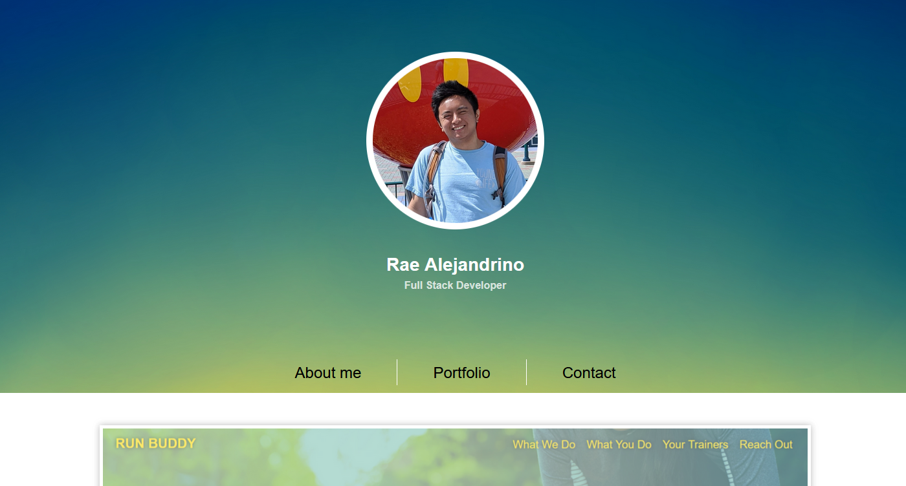

# Rae Alejandrino Portfolio Deployment

## The repository
This repository is where I (Rae Alejandrino) implement, edit, and publish my Portfolio.  

## Rae Alejandrino Portfolio

In this repository, not only will you find the files, commits, and changes done to my portfolio but also the live url deployment where you can find my website fully functioning.<a href="https://raealejandrino.github.io/Portfolio/">There</a>, you can find a description about myself, **links to contact me**, and most importantly, my portfolio with more links to my **deployed projects**.
